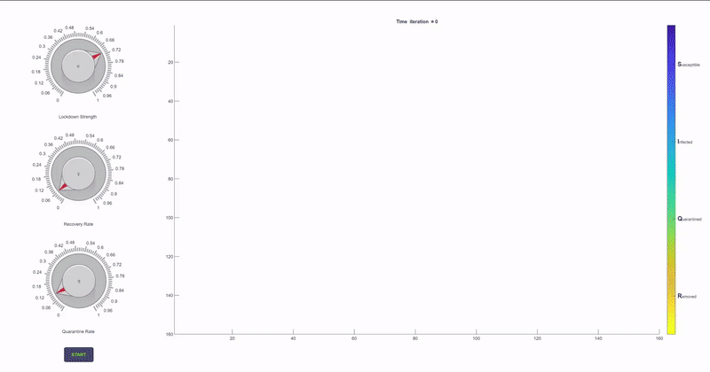

# Nonlinear Dynamics Repository

A collection of simulation and modeling tools for exploring complex systems and nonlinear dynamics. This repository provides MATLAB and Python-based applications that include interactive cellular automata, iterated maps, and chaos simulations. The MATLAB apps (such as the SIQR 2D Cellular Automaton) offer real-time interactivity with knob controls, while the Python modules implement classic iterated maps and numerical methods for studying chaotic behavior and bifurcation phenomena.



> **Note:** These tools are primarily educational and research-focused and may require further modifications for production use.

---

## Table of Contents

- [Overview](#overview)
- [Architecture](#architecture)
- [Directory Structure](#directory-structure)
- [Requirements](#requirements)
- [Usage](#usage)
- [Testing](#testing)
- [Contributing](#contributing)
- [License](#license)
- [Future Work](#future-work)

---

## Overview

This repository provides a suite of simulation tools to study nonlinear dynamics, chaos, and complex systems. The project is divided into two main parts:

**MATLAB Applications**  
Interactive, real-time cellular automata simulations (for example, the COVID‑19 SIQR 2D Cellular Automaton) allow users to adjust model parameters—lockdown strength (α), recovery rate (ɣ), and quarantine rate (q)—via intuitive knob controls. These apps incorporate performance enhancements such as vectorized computations, efficient RNG management, and preallocation techniques for improved responsiveness. Changes to the parameters take effect immediately during the simulation.

**Python Modules**  
Implementations of classic iterated maps (such as the logistic map, tent map, complex-valued iterated map, and exponential map) and numerical solvers (for example, a fourth-order Runge‑Kutta method) serve as practical examples for exploring chaotic dynamics and bifurcation phenomena. The code adheres to modern Python practices with type annotations, input validation, error handling, and logging.

---

## Architecture

The project is designed with modularity in mind to facilitate future expansion and experimentation:

**MATLAB Apps**  
- Developed using MATLAB App Designer.
- UI components (figure, axes, knobs, labels, buttons) are separated from simulation logic.
- Real-time simulation updates are achieved through vectorized operations (e.g., convolution for neighbor updates), preallocation of arrays, and efficient random number generation.
- The SIQR Cellular Automaton app uses interactive knob controls to adjust model parameters immediately during simulation.

**Python Tools**  
- Each module implements a specific iterated map or numerical method.
- Code is organized with clear function boundaries, comprehensive docstrings, type hints, and logging.
- The Python scripts provide standalone simulations and visualizations, such as bifurcation diagrams and chaos plots.

---

## Directory Structure

- **MATLAB/**
  - *SIQR_Cellular_Automaton.mlapp*  
    Interactive app for simulating the COVID‑19 SIQR 2D Cellular Automaton with real-time parameter controls.
  - (Additional MATLAB files for other nonlinear dynamics simulations may be present.)
- **Python/**
  - *logistic_map.py*  
    Logistic map simulation with a bifurcation diagram.
  - *tent_map.py*  
    Implementation of the Tent Map.
  - *complex_iterated_map.py*  
    Complex-valued iterated map simulation.
  - *rk4_method.py*  
    Fourth-order Runge-Kutta ODE solver.
  - *exponential_map.py*  
    Exponential map bifurcation diagram simulation.
- *2D_Cellular_Automaton.gif*  
  Sample animation of the cellular automaton in action.
- *LICENSE*  
  MIT License.
- *README.md*  
  This documentation file.

---

## Requirements

- **MATLAB R2022a or later**  
  (Download MATLAB at [https://www.mathworks.com/products/matlab.html](https://www.mathworks.com/products/matlab.html))
- **Python 3.9.1 or later (64‑bit)**  
  (Download Python at [https://www.python.org/downloads/](https://www.python.org/downloads/))

---

## Usage

### MATLAB Applications

1. **Open the App in MATLAB:**
   - Navigate to the **MATLAB** folder.
   - Open *SIQR_Cellular_Automaton.mlapp* in App Designer.
2. **Run the App:**
   - Adjust simulation parameters using the interactive knobs for lockdown strength (α), recovery rate (ɣ), and quarantine rate (q). Changes are applied in real time.
   - Click the **RUN** button to start (or reset) the simulation. The app will display the evolving state of the cellular automaton in real time.

### Python Modules

1. **Clone the Repository:**
   - Run:
     ```bash
     git clone https://github.com/sabneet95/Nonlinear-Dynamics.git
     ```
     Then change directory:
     ```bash
     cd Nonlinear-Dynamics/Python
     ```
2. **Run a Module:**
   - For example, to run the logistic map simulation, execute:
     ```bash 
     python logistic_map.py
     ```
   - Similarly, run other modules (e.g., *tent_map.py*, *rk4_method.py*, *exponential_map.py*) as needed.

---

## Testing

*Note: Automated tests are not yet integrated. Contributions to add testing frameworks (e.g., pytest for Python and MATLAB Unit Testing Framework for MATLAB) are welcome.*

---

## Contributing

Contributions are welcome! To contribute:
1. **Discuss Major Changes:**  
   Open an issue to discuss proposed changes before submitting pull requests.
2. **Follow Coding Standards:**  
   Ensure your code is well-documented with clear inline comments, and update tests and documentation accordingly.
3. **Submit Pull Requests:**  
   Provide clear descriptions of your changes and include tests where applicable.

---

## License

This repository is licensed under the [MIT License](LICENSE).

---

## Future Work

Planned enhancements include:
- Adding support for additional nonlinear models and simulation tools.
- Integrating automated testing frameworks for both MATLAB and Python.
- Expanding documentation with detailed examples, design rationale, and a project roadmap.
- Improving performance and scalability for larger simulations.
- Enhancing the UI/UX of MATLAB apps for better interactivity.

---

For further information or questions, please refer to the Issues section or contact the maintainers directly.

